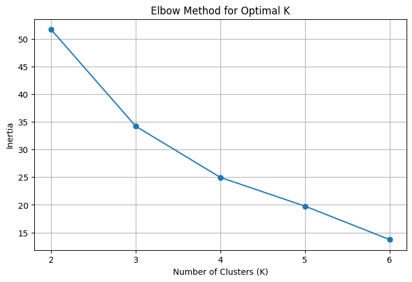
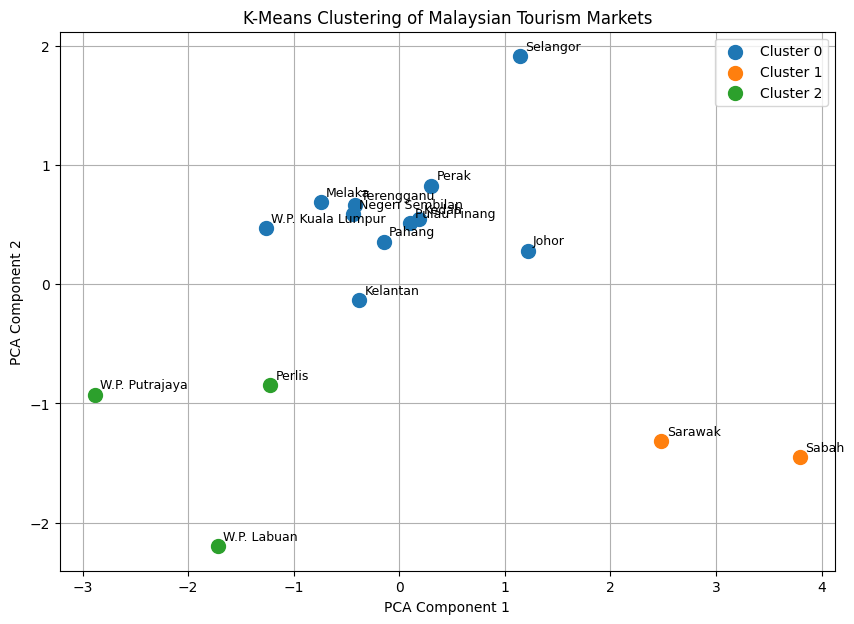

# 🇲🇾 Malaysia Tourism Analytics — DOSM Datathon 2026
**Power BI • Python • K-Means Clustering • PCA • Data Analytics • Data Visualization**

> A data analytics and machine-learning project developed for DOSM Datathon 2026 to explore tourism trends and identify distinct tourism market structures across Malaysian states.

An interactive tourism analytics project developed for **DOSM Datathon 2026**, combining **Power BI** visualisation with **Python and K-Means Clustering** to uncover tourism patterns across Malaysian states.

## 📌 Project Overview

This project analyses Malaysian tourism data to understand tourism trends, visitor flows, market dependency, diversification, and similarities between states.

The project combines **Exploratory Data Analysis (EDA)** with **Machine Learning** to transform tourism statistics into meaningful and actionable insights.

## 🎯 Objectives

- Analyse tourism trends across Malaysian states
- Explore origin-to-destination tourism flows
- Measure local tourism dependency and market diversification
- Identify tourism market structures
- Group states with similar tourism characteristics using K-Means Clustering
- Develop an interactive Power BI dashboard for data-driven decision making

## 🛠️ Tools & Technologies

- Power BI
- Python
- Google Colab
- Pandas
- Scikit-learn
- Matplotlib
- K-Means Clustering

## 📊 Exploratory Data Analysis

Exploratory Data Analysis (EDA) was conducted in Power BI before the
machine-learning stage to understand tourism trends, state-level performance,
visitor flows and tourism market structures.

### 1. State Trend EDA


The State Trend EDA examines changes in domestic tourism performance across
Malaysian states from 2018 to 2025.

The analysis includes:

- Domestic visitor trends by state from 2018–2025
- Comparison of domestic visitors between 2024 and 2025
- Visitor volume by state in 2025
- Year-on-year visitor growth by state
- Relationship between visitor volume and growth

The analysis helps distinguish states with high visitor volumes from states
experiencing stronger relative growth.

### 2. Tourism Flow EDA


The Tourism Flow EDA analyses how domestic visitors move between origin and
destination states in 2025.

The analysis includes:

- Origin-to-destination tourism flow matrix
- Top destinations by selected origin state
- Local Dependency by destination state
- Source Market Diversification by destination state
- Comparison between Local Dependency and Source Diversification

This analysis provides a deeper understanding of whether destinations rely
heavily on local visitors or attract visitors from a more diversified range
of source markets.

## 🗂️ Dataset

The analysis uses Malaysian tourism data for the DOSM Datathon 2026.

For the machine-learning component, state-level tourism indicators were
prepared into `ML_Features_2025.csv`.

Key features include:

- `Diversification_Score`
- `Local_Dependency`
- `Visitors_2025`
- `YoY_Growth_2025`
- `Population_2025`
- `Tourism_Intensity`

These indicators were used to analyse differences in tourism market
structure and as inputs for the K-Means clustering analysis.

📁 [View the processed ML dataset](data/ML_Features_2025.csv)

## 🤖 Machine Learning — K-Means Clustering

### Why K-Means?

While Power BI helps visualise tourism patterns, K-Means clustering was used to identify groups of Malaysian states with similar tourism characteristics automatically.

K-Means is an **unsupervised machine learning algorithm**, making it suitable for this project because the dataset does not contain predefined cluster labels.

### Machine Learning Workflow

1. Data preparation
2. Feature selection
3. Feature scaling
4. Evaluation of different K values
5. Elbow Method and Silhouette Score analysis
6. K-Means clustering
7. PCA visualisation
8. Integration of cluster results into Power BI

### 📉 Selecting the Number of Clusters — Elbow Method

To determine an appropriate number of clusters, K-Means was tested using **K = 2 to K = 6**.



The inertia values decreased as the number of clusters increased:

| K | Inertia | Silhouette Score |
|---|---:|---:|
| 2 | 51.69 | 0.451 |
| 3 | 34.21 | 0.367 |
| 4 | 24.96 | 0.366 |
| 5 | 19.76 | 0.223 |
| 6 | 13.73 | 0.204 |

The largest reduction in inertia occurred between **K = 2 and K = 3**, after which the improvements became more gradual.

Although **K = 2 produced the highest Silhouette Score**, **K = 3** was selected as a practical balance between the Elbow Method and obtaining a more informative segmentation of tourism market structures.

### 🧩 K-Means Clustering Result

The final model was therefore developed using **three clusters**.



For visualisation, **Principal Component Analysis (PCA)** was used to reduce the clustering features into two dimensions.

The PCA plot allows the cluster structure to be visualised while the K-Means model itself groups states according to the selected tourism characteristics.

The resulting cluster labels were subsequently integrated into the Power BI dashboard to support interactive analysis and comparison between states.

### 🔍 Cluster Interpretation

The three clusters reveal distinct tourism market structures across Malaysian states.

| Cluster | Market Segment | Diversification | Local Dependency | YoY Growth | Tourism Intensity |
|---|---|---:|---:|---:|---:|
| 0 | Established & Diversified Tourism Markets | 84.36 | 14.69 | 10.70% | 10.91 |
| 1 | Locally Dependent Tourism Markets | 49.14 | 70.22 | 12.18% | 7.47 |
| 2 | Emerging High-Growth Markets | 86.00 | 1.03 | 24.64% | 14.90 |

**Cluster 0 — Established & Diversified Tourism Markets**

This cluster has a high average diversification score (84.36) and relatively low local dependency (14.69), indicating tourism markets with a broader visitor base and comparatively established market structures.

**Cluster 1 — Locally Dependent Tourism Markets**

This cluster, consisting of **Sabah and Sarawak**, records the highest local dependency (70.22) and the lowest diversification score (49.14). This indicates stronger reliance on local tourism markets and highlights an opportunity to diversify visitor source markets.

**Cluster 2 — Emerging High-Growth Markets**

This cluster consists of **Perlis, W.P. Labuan and W.P. Putrajaya**. Although average visitor volume is considerably lower, the cluster records the highest YoY growth (24.64%), highest tourism intensity (14.90), very low local dependency (1.03), and high diversification (86.00).

These characteristics suggest smaller tourism markets experiencing strong relative growth, providing potential opportunities for further tourism development.

### 💡 Strategic Implications

The clustering analysis suggests that tourism strategies can be differentiated according to market structure:

- **Established & Diversified Markets:** sustain existing market diversity and optimise tourism performance.
- **Locally Dependent Markets:** expand and diversify visitor source markets.
- **Emerging High-Growth Markets:** support growth while developing tourism capacity and maintaining momentum.
  
## 🔑 Key Findings

The analysis revealed several important patterns in Malaysia's domestic tourism landscape:

- Tourism performance varies considerably across Malaysian states, highlighting differences in visitor volume, growth and tourism intensity.
- K-Means clustering identified **three distinct tourism market structures** rather than treating all states as having the same tourism characteristics.
- **Cluster 0 — Established & Diversified Tourism Markets** recorded high average diversification (84.36) and relatively low local dependency (14.69).
- **Cluster 1 — Locally Dependent Tourism Markets**, consisting of Sabah and Sarawak, recorded the highest average local dependency (70.22) and lower diversification (49.14).
- **Cluster 2 — Emerging High-Growth Markets**, consisting of Perlis, W.P. Labuan and W.P. Putrajaya, recorded the highest average YoY growth (24.64%) and tourism intensity (14.90), despite having lower absolute visitor volume.
- These differences suggest that tourism strategies can be tailored according to the market characteristics of each cluster rather than applying a single strategy across all states.
  
### 📓 Notebook

The complete Python implementation, including data preprocessing, feature scaling, Elbow Method, Silhouette Score evaluation, K-Means clustering and PCA visualisation, is available here:

➡️ [View K-Means Clustering Notebook](notebooks/tourism-kmeans-clustering.ipynb)


## 📈 Power BI Dashboard

Following the exploratory analysis and machine-learning stage, the key
findings were consolidated into an interactive Power BI dashboard.

The dashboard combines tourism performance indicators, market structure
analysis and K-Means clustering results to support state-level comparison
and tourism decision-making.

### 🏝️ Tourism Overview


The Tourism Overview provides a high-level summary of Malaysia's domestic
tourism performance, including:

- Total domestic visitors
- Tourism expenditure
- Year-on-year visitor growth
- Average length of stay
- State-level visitor volume and growth
- Domestic visitor trends over time

### 🗺️ Tourism Flow & Market Structure


This dashboard focuses on tourism market structure and allows users to
compare destinations based on:

- Local Dependency
- Source Market Diversification
- Tourism market structure
- K-Means cluster segmentation
- State-level tourism characteristics

The clustering results are integrated into Power BI to translate the
machine-learning analysis into an interactive decision-support tool.

### 📥 Power BI File

The complete interactive dashboard is available as a Power BI project file:

➡️ [Download Power BI Dashboard](powerbi/Malaysia-Tourism-Analytics-Dashboard.pbix)

## 📄 Project Report

The complete written report documents the project's methodology, exploratory
data analysis, machine-learning approach, findings and recommendations.

📖 [View Project Report](report/DOSM-Datathon-2026-Tourism-Analytics-Report.pdf)

## 👥 Team

Developed for **DOSM Datathon 2026** by:

- Balqish
- Deeja
- Nadh
- Puti

## 👩‍💻 My Contribution

My contributions to the project include:

- Exploratory Data Analysis
- Power BI dashboard development
- Tourism indicator visualisation
- K-Means clustering implementation and analysis
- Integration of machine-learning results into Power BI

## 📁 Repository Structure

```text
├── data/
├── images/
├── notebooks/
├── powerbi/
├── report/
└── README.md
